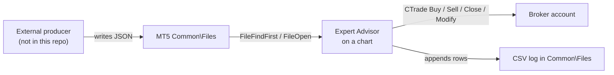

# MT5 Channel Signal Monitor

Two MetaTrader 5 Expert Advisors that watch for trade signals dropped as JSON files
into the terminal's shared `Common\Files` folder, and turn them into orders on the
connected account. "Channel" here means a messaging channel (a Telegram signal
group), not a price channel — the EAs do no chart analysis of their own.

## Status

Experimental / personal research code. The trade, risk-sizing and logging paths are
all implemented, but there are no tests, no CI and no release build, and neither EA
here has been compile-verified while preparing the repository for publication. Read
these as sources to check and fix, not as something guaranteed to build unmodified.

`ChannelSignalMonitor` is the one that has demonstrably been run — the repository
history contains a CSV run log it produced. `MultiCurrency_TelegramEA` has no such
evidence and almost certainly does **not** compile as it stands; see
[Known defects](#known-defects).

The two EAs are separate experiments with different file formats and different
feature sets — they are not two halves of one product and should not be run against
the same signal source.

**The component that produces the signal JSON is not in this repository.** Both EAs
are consumers only. Something else — a Telegram reader or any other script — has to
write the files described below into `Common\Files`. Nothing here scrapes, parses or
connects to Telegram.

## How it works



Both EAs poll rather than subscribe: there is no socket, no HTTP call and no DLL
import anywhere in the code. Everything crosses the boundary as a file in
`Common\Files` (`FILE_COMMON`), which on Windows is usually:

```
C:\Users\<you>\AppData\Roaming\MetaQuotes\Terminal\Common\Files\
```

JSON is parsed by hand with `StringFind` / `StringSubstr` — there is no JSON
library. The parsers are tolerant but shallow: they find the first occurrence of a
key and read up to the next delimiter, so they depend on the exact field names
described below.

### ChannelSignalMonitor (one chart, one symbol)

`ChannelSignalMonitor_EA/Experts/ChannelSignalMonitor.mq5`

Runs on a single chart and only ever trades that chart's symbol. On each tick, and
at most once per `scanIntervalSeconds`, it searches `Common\Files` for
`<channelName>_<symbol>_*.json`. For every file it has not seen before in this
session it:

1. Reads the file and pulls `source`, `symbol`, `action`, `price`, `sl`, `tp`,
   `event_type`, `order_type` and `time_utc` out of the text.
2. Rejects the file if `symbol` does not match the chart symbol, or `action` is empty.
3. Converts `time_utc` to broker server time using `brokerGMTOffset`, and discards
   the signal as `EXPIRED` if it is more than `signalWindowMinutes` away from now.
   This is the main gate — a stale signal file is logged and ignored, never traded.
4. On `event_type` `entry`, opens a market order in the signal's direction at the
   current ask/bid (the signal's own `price` is logged but not used as the entry).
   On `exit` or `close`, closes this EA's positions on the symbol.

Stop loss and take profit come from the signal but are clamped before use: pushed
out to the broker's `SYMBOL_TRADE_STOPS_LEVEL` if too tight, capped at
`maxSLPoints`, and defaulted to `minSLPoints` if the signal carried no SL. Lot size
is derived from `riskPercentage` of account balance over the SL distance, falling
back to `defaultLotSize` when tick value is unavailable. Positions are tagged with
the hard-coded magic number `20240827`.

Processed filenames are remembered in memory only, so restarting the EA re-reads
every matching file in the folder; the time window is what stops old files being
traded twice.

Every event — init, scan, parse, level adjustment, order result, error, deinit —
is appended as a row to `<channelName>_<symbol>_monitor_log.csv` in `Common\Files`,
with bid, ask, balance, equity, free margin and open position count on each row.

### MultiCurrency_TelegramEA (one chart, many symbols)

`mql5/MultiCurrency_TelegramEA.mq5`

Runs on any single chart but trades a whitelist of symbols. It polls on
`OnTimer` every `TimerSeconds` and reads one aggregate file, `SignalFileName`
(default `multicurrency_signals.json`), shaped as
`{"timestamp": "...", "signals": {"EURUSD": {...}, "XAUUSD": {...}}}`. The
top-level `timestamp` is the de-duplication key: if it has not changed since the
last poll, the file is skipped entirely.

For each whitelisted symbol present in `signals` it reads `action`, `price`, `sl`
and `tp` and acts on the action: `buy`/`sell` open, `close` closes, `update_sl` and
`update_tp` modify an existing position. A same-direction signal on an open
position updates its SL/TP instead of stacking; an opposite signal closes and
reopens. Opening requires a valid SL — without one the signal is skipped, because
SL distance is what sizes the trade.

This EA adds three things the single-symbol one does not have: a daily loss cutout
(`MaxDailyLoss`, measured against the account balance recorded at the start of the
trading day), automatic breakeven, and a trailing stop. Breakeven and trailing are
applied to every managed position near the top of each timer tick — but only after
the daily loss check passes. `OnTimer` does `if(!CheckDailyLossLimit()) return;`
first, so once the limit trips the EA stops doing anything at all until the server
day rolls over: no breakeven, no trailing, and no signal reads. Open positions are
left with whatever stops they already had. It prints to the Experts log and does not
write a CSV.

## Known defects

Found by reading the code, not by running it. None of them are fixed in this
repository.

- **`MultiCurrency_TelegramEA` redefines two MQL5 built-ins.** It declares
  `string StringTrimLeft(const string str)` (line 408) and
  `string StringTrimRight(const string str)` (line 416), colliding with the built-in
  `int StringTrimLeft(string&)` / `int StringTrimRight(string&)`. MetaEditor
  normally refuses this outright as an attempt to override a system function. Even
  in the best case, where the calls resolved to the built-ins, `ParseAllowedSymbols`
  does `symbol = StringTrimLeft(symbol);` (line 394) — assigning an `int` return
  into a `string`, which turns every whitelist entry into a number and leaves the EA
  matching no symbols at all. Renaming the two helpers and their two call sites
  (`TrimLeftStr` / `TrimRightStr`) is the obvious fix; it is deliberately not applied
  here, so that the change is made by the developer against a real compiler.
- **`CommonFilesDir` cannot do what its name suggests.** `ReadSignalJson` retries
  with `FileOpen(path, FILE_READ|FILE_TXT|FILE_ANSI|FILE_SHARE_READ)` (line 642) —
  without `FILE_COMMON`. MQL5 file access is sandboxed, so that path is resolved
  inside `<data folder>\MQL5\Files` and an absolute directory can never be opened
  through it. The input is effectively dead.
- **`EnableNewsFilter` does nothing.** It is declared as an input and never read
  anywhere in the file.
- **The daily loss cutout is wider than it sounds.** As described above, tripping
  `MaxDailyLoss` suspends management of open positions as well as new entries.

## Requirements

- MetaTrader 5 terminal with MetaEditor (the compiler ships with the terminal).
- No external libraries. Both files include only the standard library headers
  `Trade\Trade.mqh` and `Trade\PositionInfo.mqh`.
- A producer process that writes the signal files. Not included here.

## Setup

1. In MetaTrader 5, open **File → Open Data Folder** and go into `MQL5\Experts`.
2. Copy the EA you want into it:
   - `ChannelSignalMonitor_EA/Experts/ChannelSignalMonitor.mq5`, or
   - `mql5/MultiCurrency_TelegramEA.mq5`
3. Open the file in MetaEditor (F4 from the terminal) and press **F7** to compile.
   Expect to fix compile errors first — nothing here is verified to build
   unmodified, and `MultiCurrency_TelegramEA.mq5` has a name collision with the MQL5
   built-ins that has to be resolved (see [Known defects](#known-defects)). On a
   clean build a matching `.ex5` appears next to the source; it is gitignored.
4. Back in the terminal, refresh the Navigator, drag the EA onto a chart, and on the
   **Common** tab tick *Allow Algo Trading*. Also enable the global Algo Trading
   button in the toolbar.
5. Make sure your producer writes into the shared folder, not the per-terminal one:
   **File → Open Data Folder**, then go up to `Common\Files` (or use the path listed
   above). Both EAs open files with `FILE_COMMON`.

## Configuration

Both EAs are configured entirely through MetaTrader input parameters on the EA's
Inputs tab. There are no environment variables, config files or secrets anywhere in
the code.

### ChannelSignalMonitor inputs

| Input | Default | Meaning |
| --- | --- | --- |
| `channelName` | `My_Channel` | Filename prefix to watch for; also the log file prefix |
| `signalWindowMinutes` | `5` | Signal is ignored if its timestamp is further than this from now |
| `riskPercentage` | `1.0` | Percent of account balance risked per trade |
| `defaultLotSize` | `0.01` | Lot size used when risk sizing cannot be computed |
| `slippagePoints` | `10` | Max deviation passed to `CTrade` |
| `minSLPoints` | `100` | SL distance used when a signal has no SL |
| `maxSLPoints` | `500` | SL distance is capped at this |
| `scanIntervalSeconds` | `5` | Minimum gap between folder scans |
| `fileMonitorIntervalSeconds` | `60` | How often the "still waiting for files" line is logged |
| `enableLogging` | `true` | Verbose printing to the Experts tab |
| `enableFileLogging` | `true` | Write the CSV log in `Common\Files` |
| `brokerGMTOffset` | `3` | Broker server offset from UTC, used to age-check signals |
| `assumeCurrentYearMonth` | `true` | Rewrite a signal timestamp more than a day in the future to the current year/month |

### MultiCurrency_TelegramEA inputs

| Input | Default | Meaning |
| --- | --- | --- |
| `SignalFileName` | `multicurrency_signals.json` | File polled in `Common\Files` |
| `CommonFilesDir` | *(empty)* | Meant as a fallback directory, but the retry drops `FILE_COMMON` and stays inside the sandbox, so an absolute path never opens. Dead — see [Known defects](#known-defects) |
| `RiskPercent` | `1.0` | Percent of balance risked per trade |
| `MaxRiskPercent` | `5.0` | Hard ceiling applied to `RiskPercent` |
| `MaxDailyLoss` | `10.0` | Percent drawdown from the day's starting balance. Once exceeded the whole timer tick aborts — no new trades **and** no breakeven or trailing on open positions — until the next server day |
| `MaxSlippagePoints` | `50` | Max deviation for open and close |
| `MagicNumber` | `20250814` | Tag written on this EA's positions |
| `ManageOnlyOurPositions` | `true` | Ignore positions that do not carry the magic number |
| `TimerSeconds` | `3` | Poll interval |
| `EnableNewsFilter` | `false` | Declared but not referenced anywhere in the code; it does nothing |
| `EnableBreakeven` | `true` | Move SL to entry once in profit |
| `BreakevenTriggerPoints` | `300` | Profit in points that triggers breakeven |
| `BreakevenOffsetPoints` | `20` | Points beyond entry the breakeven SL is placed |
| `EnableTrailingStop` | `true` | Trail the SL after the trailing threshold |
| `TrailStartPoints` | `400` | Profit in points before trailing starts |
| `TrailStepPoints` | `100` | Distance the trailing SL keeps behind price |
| `AllowedSymbols` | 20 FX pairs plus `XAUUSD`, `XAGUSD` (22 in all) | Comma-separated whitelist; symbols outside it are ignored |

## Signal file format

No signal data is committed to this repository. The captured third-party signal
files and the run logs that used to live here have been removed; the shapes below
are what the parsers actually look for.

### Per-signal file, for ChannelSignalMonitor

Filename must be `<channelName>_<symbol>_<anything>.json`, for example
`My_Channel_XAUUSD_20250929T050935.json`, placed in `Common\Files`.

```json
{
  "version": 1,
  "source": "My Channel",
  "symbol": "XAUUSD",
  "time_utc": "2025-09-29T05:09:35+00:00",
  "signal": {
    "symbol": "XAUUSD",
    "action": "buy",
    "price": 3749.0,
    "sl": 3744.0,
    "tp": 3780.0,
    "event_type": "entry",
    "order_type": "market"
  }
}
```

Notes on how this is read:

- Nesting is not really honoured. `ExtractJSONValue` runs a single `StringFind` for
  `"<key>":` over the whole document, so whichever occurrence comes **first in the
  text** wins, wherever it sits. Only when the key is absent everywhere does it retry
  from the start of the `signal` object — which then finds nothing either. So
  `source`, `symbol` and `time_utc` above are read from the top level because they
  appear earlier in the file, not because they are top-level; and if the producer
  writes the same key at both levels with different values, field order rather than
  structure decides which one is used.
- `action` is matched with a substring test for `buy` or `sell`, case-insensitively.
- `event_type` must be `entry` to open, or `exit`/`close` to close. Anything else is
  logged as `UNKNOWN_TYPE` and ignored.
- `order_type` is parsed but not acted on — entries are always sent as market orders.
- `time_utc` is parsed as ISO-8601 with an optional `Z` or `±HH:MM` offset.

### Aggregate file, for MultiCurrency_TelegramEA

```json
{
  "timestamp": "2025-09-29T05:09:35Z",
  "signals": {
    "EURUSD": { "action": "buy",       "price": 1.0850, "sl": 1.0820, "tp": 1.0910 },
    "XAUUSD": { "action": "update_sl", "sl": 3752.0 },
    "GBPUSD": { "action": "close" }
  }
}
```

`action` is one of `buy`, `sell`, `close`, `update_sl`, `update_tp`. `price` is read
but market orders are used regardless. Change `timestamp` on every write, or the
file will be treated as already processed.

## Output

`ChannelSignalMonitor` appends to `<channelName>_<symbol>_monitor_log.csv` in
`Common\Files` (e.g. `My_Channel_XAUUSD_monitor_log.csv`), creating it with a
header row if missing. Columns:

```
timestamp, signal_id, event_type, symbol, action, signal_price, signal_sl,
signal_tp, signal_time, file_name, status, reason, bid, ask, balance, equity,
free_margin, open_positions, details
```

Commas, quotes and newlines inside a field are substituted before writing, so the
file stays parseable without quoting. `MultiCurrency_TelegramEA` writes no file; its
trace goes to the terminal's Experts tab only.

## Project layout

```
ChannelSignalMonitor_EA/
  Experts/
    ChannelSignalMonitor.mq5    Single-symbol EA; per-signal JSON files, CSV logging
mql5/
  MultiCurrency_TelegramEA.mq5  Multi-symbol EA; one aggregate JSON, breakeven + trailing
```

The two directories reflect how the files were developed rather than any build
requirement — `ChannelSignalMonitor_EA/Experts/` mirrors the terminal's own
`MQL5\Experts` path. Either file can be compiled on its own.

## Tests

There are none. No unit tests, no strategy-tester `.set` files, no CI. Verify
changes by compiling in MetaEditor and running on a demo account with the MT5
Strategy Tester or a live demo chart.

## Risk and disclaimer

This is not financial advice. This code places real orders on whatever account the
terminal is logged into, sizes them from account balance, and has no manual
confirmation step — a malformed or hostile signal file becomes a trade. Automated
trading can lose money quickly, and losses can exceed expectations with leverage.

The signal-consuming logic has known rough edges: JSON is parsed by string search
rather than a real parser, the `ChannelSignalMonitor` de-duplication list is
in-memory and resets on restart, and neither EA verifies where a signal file came
from. Run on a demo or paper account first, for long enough to see the behaviour you
expect, and never point it at money you cannot afford to lose. Use at your own risk.

## License

MIT — see [LICENSE](LICENSE).
